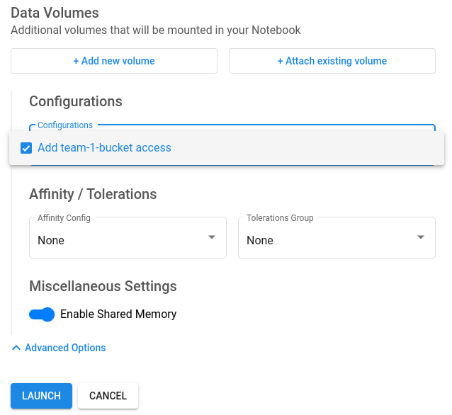

# Kubeflow with Ceph

## Tools
```bash
brew install argocd
brew install jq
```

## Install rook-ceph
```bash
helm repo add rook-release https://charts.rook.io/release
helm repo update
helm install --create-namespace --namespace rook-ceph rook-ceph rook-release/rook-ceph 
helm install --namespace rook-ceph rook-ceph-cluster \
   --set operatorNamespace=rook-ceph rook-release/rook-ceph-cluster

kubectl rook-ceph ceph status
```

## [Optional] Install KDCC
```bash
helm repo add data-control-center https://koor-tech.github.io/data-control-center
helm repo update
helm install --create-namespace --namespace rook-ceph data-control-center data-control-center/data-control-center -f deploy/kdcc-values.yaml

kubectl --namespace rook-ceph port-forward svc/data-control-center 8282:8282
```
Access `localhost:8282`

## Create OBC
```bash
kubectl apply -f deploy/obc.yaml
```


## Install argocd
```bash
# clone the deploykf repo
# NOTE: we use 'main', as the latest plugin version always lives there
git clone -b main https://github.com/deployKF/deployKF.git ./deploykf

# ensure the script is executable
chmod +x ./deploykf/argocd-plugin/install_argocd.sh

# run the install script
# WARNING: this will install into your current kubectl context
bash ./deploykf/argocd-plugin/install_argocd.sh

kubectl get po -n argocd
```

To access:
```bash
kubectl port-forward svc/argocd-server -n argocd 8081:443
```

Access `localhost:8081`

The initial password is: 
```bash
kubectl get -n argocd secret/argocd-initial-admin-secret -o jsonpath="{.data.password}" | base64 -d
```

## Install app of apps
```bash
kubectl apply -f deploy/deploykf-app-of-apps.yaml
```

## Sync Argocd
```bash
# clone the deploykf repo
# NOTE: we use 'main', as the latest script always lives there
git clone -b main https://github.com/deployKF/deployKF.git ./deploykf

# ensure the script is executable
chmod +x ./deploykf/scripts/sync_argocd_apps.sh

# run the script
bash ./deploykf/scripts/sync_argocd_apps.sh
```


## Access the platform
Modify hosts:
You will need to add the following lines to the END of your local /etc/hosts file:

```
127.0.0.1 deploykf.example.com
127.0.0.1 argo-server.deploykf.example.com
127.0.0.1 minio-api.deploykf.example.com
127.0.0.1 minio-console.deploykf.example.com
```

Port forward:
```bash
kubectl port-forward \
  --namespace "deploykf-istio-gateway" \
  svc/deploykf-gateway 8080:http 8443:https
```

Go to deploykf.example.com

Username: user1@example.com
Password: user1


## Use in a notebook
### Create a bucket
```bash
kubectl apply -f deploy/team-1-obc.yaml
```

### Create a PodDefault 
```bash
kubectl apply -f deploy/pod-default-add-obc.yaml
```

When creating a notebook, select the configuration under advanced settings



In the notebook, install boto3
```
!pip install boto3
```

Then use it as follows
```python
import os
import boto3

aws_access_key_id = os.environ['AWS_ACCESS_KEY_ID']
aws_secret_access_key = os.environ['AWS_SECRET_ACCESS_KEY']
endpoint_url = "http://" + os.environ['BUCKET_HOST']

s3_client = boto3.client('s3', 
    aws_access_key_id=aws_access_key_id,
    aws_secret_access_key=aws_secret_access_key,
    endpoint_url=endpoint_url,
    use_ssl=False,
)
s3_client.list_buckets()
```