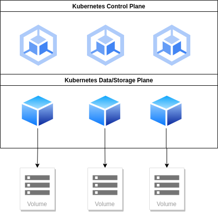

## Setup a Kubernetes Cluster for KSD using Hetzner Cloud

This guide is to be ready and test KSD easily.

### IMPORTANT:
In order to be able to follow all the steps you would need a Hetzner Api token, to get this you will need: 
- Sign in into the Hetzner Cloud Console 
- choose a Project
- go to Security → API Tokens
- generate a new token.

Once you have your token you must export your token in order to use it during the process
```console 
$ export HCLOUD_TOKEN=GlPz.....
```


> If you have troubles please visit the Hetzner Cloud Documents [https://docs.hetzner.cloud/](https://docs.hetzner.cloud/)

## Requirements
- Kubeone
  - You can install it by using `curl -sfL https://get.kubeone.io | sh`
- Terraform v1.5.2
- A new ssh key only for this purpose (how to generate a new ssh-key)
- Kubectl (how to install kubectl)
- Api Token Hetzner Cloud


## Architecture



## Hands On

Is time to try KSD so the first step is to have a Kubernetes cluster ready to use

#### 1. Clone this repository
```console 
git clone git@github.com:koor-tech/demo-gitops.git
```
#### 2. Navigate to kubernetes-cluster-demo
```console 
$ cd kubernetes-cluster-demo/terraform/
```

#### 3. Initialize the terraform configuration
```console 
$ terraform init

Initializing the backend...

Initializing provider plugins...
- Finding hetznercloud/hcloud versions matching "~> 1.31.0"...
- Installing hetznercloud/hcloud v1.31.1...
- Installed hetznercloud/hcloud v1.31.1 (signed by a HashiCorp partner, key ID 5219EACB3A77198B)

Partner and community providers are signed by their developers.
If you'd like to know more about provider signing, you can read about it here:
https://www.terraform.io/docs/cli/plugins/signing.html

Terraform has created a lock file .terraform.lock.hcl to record the provider
selections it made above. Include this file in your version control repository
so that Terraform can guarantee to make the same selections by default when
you run "terraform init" in the future.

Terraform has been successfully initialized!

You may now begin working with Terraform. Try running "terraform plan" to see
any changes that are required for your infrastructure. All Terraform commands
should now work.

If you ever set or change modules or backend configuration for Terraform,
rerun this command to reinitialize your working directory. If you forget, other
commands will detect it and remind you to do so if necessary.
```
#### 4. Setup your cluster
Inside the terraform folder you could find a file called `terraform.tfvars.example` use that file to set up your cluster as you need
```console
$ cp terraform.tfvars.example terraform.tfvars
```

KSD can run in different clusters but here are the minimum requirements expected in a production environment:
 - 3 Nodes in control plane
   - 4 CPU
   - 8 GB RAM
 - 3 Nodes on data/worker nodes
   - 8 CPU
   - 16 GB RAM
 - Calico as CNI

#### 4. Validate your changes
Run `terraform plan` to examine what changes will be applied in your infrastructure
```console
$ terraform plan                                                                      
hcloud_placement_group.control_plane: Refreshing state... [id=185187]
hcloud_load_balancer.load_balancer[0]: Refreshing state... [id=1361514]
hcloud_network.net: Refreshing state... [id=3137203]
hcloud_ssh_key.kubeone: Refreshing state... [id=13174070]
hcloud_firewall.cluster: Refreshing state... [id=975915]
hcloud_server.control_plane[0]: Refreshing state... [id=35048829]
hcloud_server.control_plane[2]: Refreshing state... [id=35048828]
hcloud_server.control_plane[1]: Refreshing state... [id=35048830]
hcloud_network_subnet.kubeone: Refreshing state... [id=3137203-192.168.0.0/16]
hcloud_load_balancer_service.load_balancer_service[0]: Refreshing state... [id=1361514__6443]
hcloud_load_balancer_network.load_balancer[0]: Refreshing state... [id=1361514-3137203]
hcloud_server_network.control_plane[0]: Refreshing state... [id=35048829-3137203]
hcloud_server_network.control_plane[2]: Refreshing state... [id=35048828-3137203]
hcloud_server_network.control_plane[1]: Refreshing state... [id=35048830-3137203]
.....
```
#### 4. Apply your changes
This changes only will create your infrastructure and Kubernetes will be installed later
```console
$ terraform apply

Terraform used the selected providers to generate the following execution plan. Resource actions are indicated with the following symbols:
  + create

Terraform planned the following actions, but then encountered a problem:

  # hcloud_firewall.cluster will be created
  + resource "hcloud_firewall" "cluster" {
      + id     = (known after apply)
      + labels = {
          + "kubeone_cluster_name" = "koor-demo"
        }
      + name   = "koor-demo-fw"

      + apply_to {
          + label_selector = "kubeone_cluster_name=koor-demo"
          + server         = (known after apply)
        }

      + rule {
          + description     = "allow ICMP"
          + destination_ips = []
          + direction       = "in"
          + protocol        = "icmp"
          + source_ips      = [
          ....
```
#### 5. Save your infrastructure
You need to save your terraform state into a tf.json file that will be used later for setup your Kubernetes Clusters
```console
$ terraform output -json > tf.json
```
#### 6. Deploy your Cluster
You already have a `kubeone.yaml` file with the required configuration, but you can update it as you need, and just you need to run:
```console
$ kubeone apply -m kubeone.yaml -t tf.json
```

####  7. Add your volumes

####  8. Install KSD

####  9. Verify your Ceph Cluster

####  10. Deploy your app that you needs