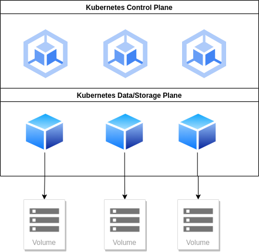
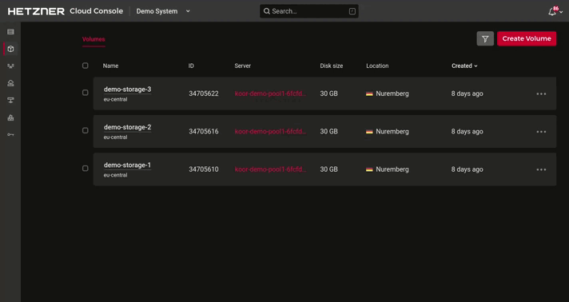

## Setup a Kubernetes Cluster for Rook using Hetzner Cloud

This document will walk you through the steps required to set up a Kubernetes cluster in the Hetzner Cloud for use with Rook.

### IMPORTANT:

To follow this guide, you will need a Hetzner API token.  To generate this you will need to: 
- Sign in into the [Hetzner Cloud Console](https://console.hetzner.cloud/)
- Select your project
- Go to Security → API Tokens
- Generate a new token

Once you have your token, export it to your shell's environment:
```console 
$ export HCLOUD_TOKEN=GlPz.....
```


> If you have trouble, please visit the [Hetzner Cloud documentation](https://docs.hetzner.cloud/) site.

## Requirements

- Kubeone v1.6.2
  - AMD64 and ARM64 binaries can be found on [Kubermatic's GitHub page](https://github.com/kubermatic/kubeone/releases).
- Terraform v1.5.2 or greater
    - Various installation methods can be found on [Hashicorph's installation page](https://developer.hashicorp.com/terraform/install).
- A new ssh key generated for this project
    - This can be created by running `ssh-keygen` on your console.  When prompted, enter a name and a location for the new key pair.
- Kubectl
    - Various installation methods can be found in the [Kubernetes installation guide](https://kubernetes.io/docs/tasks/tools/).
- A Hetzner Cloud API token
- `ssh-agent` running in your shell
    - On your console, run the following:
        ```console
        $ eval `ssh-agent -s`
        $ ssh-add /path/to/private/key
        ```


## Architecture



## Hands On

It's time to prepare your Kubernetes cluster for Rook usage.

#### 1. Clone the Koor demonstration repository

```console 
git clone git@github.com:koor-tech/demo-gitops.git
```

#### 2. Navigate to the terraform directory beneath kubernetes-cluster-kubeone

```console 
$ cd demo-gitops/kubernetes-cluster-kubeone/terraform
```

#### 3. Initialize the terraform configuration

```console 
$ terraform init

Initializing the backend...

Initializing provider plugins...
- Finding hetznercloud/hcloud versions matching "~> 1.31.0"...
- Installing hetznercloud/hcloud v1.31.1...
- Installed hetznercloud/hcloud v1.31.1 (signed by a HashiCorp partner, key ID 5219EACB3A77198B)

Partner and community providers are signed by their developers.
If you'd like to know more about provider signing, you can read about it here:
https://www.terraform.io/docs/cli/plugins/signing.html

Terraform has created a lock file .terraform.lock.hcl to record the provider
selections it made above. Include this file in your version control repository
so that Terraform can guarantee to make the same selections by default when
you run "terraform init" in the future.

Terraform has been successfully initialized!

You may now begin working with Terraform. Try running "terraform plan" to see
any changes that are required for your infrastructure. All Terraform commands
should now work.

If you ever set or change modules or backend configuration for Terraform,
rerun this command to reinitialize your working directory. If you forget, other
commands will detect it and remind you to do so if necessary.
```

#### 4. Setup your cluster

In the terraform directory, copy the `terraform.tfvars.example` file to `terraform.tfvars`, and modify the values to describe your cluster:
```console
$ cp terraform.tfvars.example terraform.tfvars
```
```source
cluster_name = "koor-demo"
ssh_public_key_file = "~/.ssh/id_rsa.pub"
control_plane_vm_count=3
initial_machinedeployment_replicas=3
worker_type="cpx41"
control_plane_type="cpx31"
os="ubuntu"
worker_os="ubuntu"
```

Rook is versatile, and can run on many different cluster configurations.  For a production environment, these are the minimum requirements:

 - 3 control plane nodes
   - 4 CPU
   - 8 GB RAM
 - 3 data/worker nodes
   - 8 CPU
   - 16 GB RAM
 - Calico as the CNI.  Other CNI plugins work as well, but haven't been as extensively tested.

#### 4. Validate your changes

Run `terraform plan` to see what changes will be applied to your infrastructure:
```console
$ terraform plan                                                                      
hcloud_placement_group.control_plane: Refreshing state... [id=185187]
hcloud_load_balancer.load_balancer[0]: Refreshing state... [id=1361514]
hcloud_network.net: Refreshing state... [id=3137203]
hcloud_ssh_key.kubeone: Refreshing state... [id=13174070]
hcloud_firewall.cluster: Refreshing state... [id=975915]
hcloud_server.control_plane[0]: Refreshing state... [id=35048829]
hcloud_server.control_plane[2]: Refreshing state... [id=35048828]
hcloud_server.control_plane[1]: Refreshing state... [id=35048830]
hcloud_network_subnet.kubeone: Refreshing state... [id=3137203-192.168.0.0/16]
hcloud_load_balancer_service.load_balancer_service[0]: Refreshing state... [id=1361514__6443]
hcloud_load_balancer_network.load_balancer[0]: Refreshing state... [id=1361514-3137203]
hcloud_server_network.control_plane[0]: Refreshing state... [id=35048829-3137203]
hcloud_server_network.control_plane[2]: Refreshing state... [id=35048828-3137203]
hcloud_server_network.control_plane[1]: Refreshing state... [id=35048830-3137203]
.....
```

#### 4. Apply your changes

Once you're happy with the proposed changes, apply them to create your infrastructure.  Kubernetes will be installed later.
```console
$ terraform apply

Terraform used the selected providers to generate the following execution plan. Resource actions are indicated with the following symbols:
  + create

Terraform planned the following actions, but then encountered a problem:

  # hcloud_firewall.cluster will be created
  + resource "hcloud_firewall" "cluster" {
      + id     = (known after apply)
      + labels = {
          + "kubeone_cluster_name" = "koor-demo"
        }
      + name   = "koor-demo-fw"

      + apply_to {
          + label_selector = "kubeone_cluster_name=koor-demo"
          + server         = (known after apply)
        }

      + rule {
          + description     = "allow ICMP"
          + destination_ips = []
          + direction       = "in"
          + protocol        = "icmp"
          + source_ips      = [
          ....
```

#### 5. Save your infrastructure

Save the generated terraform state to a file.  This will be used in the next step to stand up the Kubernetes cluster:
```console
$ terraform output -json -no-color > tf.json
```

#### 6. Deploy your Cluster

The `kubeone.yaml` file in the terraform directory already has all necessary configuration details, but you can modify it to meet your requirements.  

Once you're ready, run:
```console
$ kubeone apply -m kubeone.yaml -t tf.json
INFO[17:31:59 UTC] Determine hostname...
INFO[17:32:03 UTC] Determine operating system...
INFO[17:32:04 UTC] Running host probes...
The following actions will be taken:
Run with --verbose flag for more information.
	+ initialize control plane node "koor-demo-test-ian-control-plane-1" (192.168.0.3) using 1.25.6
	+ join control plane node "koor-demo-test-ian-control-plane-2" (192.168.0.4) using 1.25.6
	+ ensure machinedeployment "koor-demo-test-ian-pool1" with 4 replica(s) exists
	+ apply embedded addons
Do you want to proceed (yes/no): yes

INFO[17:32:31 UTC] Determine hostname...
INFO[17:32:31 UTC] Determine operating system...
INFO[17:32:31 UTC] Running host probes...
INFO[17:32:32 UTC] Installing prerequisites...
INFO[17:32:32 UTC] Creating environment file...                  node=1.2.3.4 os=ubuntu
INFO[17:32:32 UTC] Creating environment file...                  node=5.6.7.8 os=ubuntu
INFO[17:32:33 UTC] Configuring proxy...                          node=1.2.3.4 os=ubuntu
INFO[17:32:33 UTC] Installing kubeadm...                         node=1.2.3.4 os=ubuntu
INFO[17:32:33 UTC] Configuring proxy...                          node=5.6.7.8 os=ubuntu
INFO[17:32:33 UTC] Installing kubeadm...                         node=5.6.7.8 os=ubuntu
```

####  7. Add your volumes

For this step, you will need to access to your [Hetzner Cloud account](https://accounts.hetzner.com/login).

>To utilize all of Rook's features, we recommend associating at least one volume with each data plane node.
1. Navigate to the [Hetzner Cloud console](https://console.hetzner.cloud/)
2. Open your project
3. Go to the volumes tab in the sidebar
4. Set the volume size and name
5. Choose a data plane node to tie the volume to 
   - **Important:** Data plane nodes have the word "pool" in their names.
   - **Caution:** Do not associate volumes to Rook control plane nodes.  Rook works by deploying pods on the data plane nodes tied to your volumes. Control plane nodes are unable to host those pods themselves due to [taints and tolerations](https://kubernetes.io/docs/concepts/scheduling-eviction/taint-and-toleration/).
6. Set the *Choose mount options* slider to **manually** so that your cluster has raw block devices to consume.  You'll receive a warning, which can be dismissed.
7. Finally, click on create and buy


Congratulations!  You have created a minimal production Kubernetes Cluster that can now be used to deploy Rook. 

>Note: To _destroy_ your cluster, detach all volumes from your worker nodes, delete them, thens navigate to the `demo-gitops/kubernetes-cluster-kubeone/terraform` directory, and run `terraform apply -destroy`.